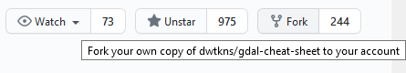

# Contributing
As a summary the best practice for contributing is to:

1. Fork it
2. Clone it to your local system
3. Make a new branch
4. Make your changes
5. Push it back to your repo
6. Click the Compare & pull request button
7. Click Create pull request to open a new pull request

You will need a [github account](https://github.com/) to contribute. It is assumed you have one and that you have familiarity with git. If you need some reminding then please read through the [maintaining guide](Maintaining.md) first. It will run through editing files all the way to committing them.

---

#### 1. Fork it
In this example (for a different git repo) click on the Fork button to make a copy to your git hub account

#### 2. Clone it to you local system

`git clone link` - the 'link' to your accounts fork of this repo

Inspect it on your system

#### 3. Make a new branch

`git checkout -b newbranch` - creates a new branch called newbranch (you can call it anything you like)

#### 4. Make the changes

Using a text editor (eg. notepadd++) or IDE (eg. pycharm)

#### 5. Push it back to your repo

`git add *` - add the changes to the header

`git commit -m "a message"` - make a commit statement

`git checkout master` - working on the master branch again

`git merge newbranch` - merge the change on the newbranch to the master

`git push` - push the changes back to orginal

#### 6. Click the Compare and pull request button
Navigate back to this repo and click on big green button marked "Compare and pull request". 

Now you will be able to (and ideally should) write a note about your pull request. It will also show you the changes you have made.

#### 7. Click Create pull request to open a new pull request
Review your changes and when you are happy then click the green "Create pull request" button. Now wait for an admin of this repo to respond. They may seek further information before merging.

## Maintaining 
For a indepth guide to editing and git commands related to this repo please visit [maintaining.md](Maintaining.md). This maybe helpful if you are unfamiliar with git desktop or git command line. The guide also contains links to more detailed documentation
